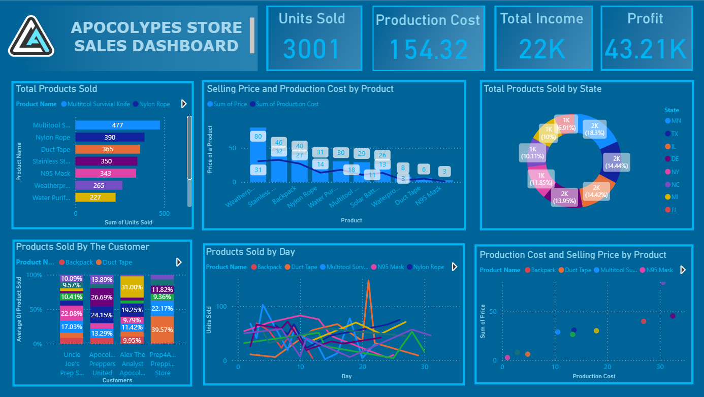

# Multi_Relationship_Table_Apocolypse_Store_Dashboard.

#  Apocolypes Store Sales Dashboard - Power BI Project

## Project Overview

This project is a comprehensive **Power BI dashboard** designed to analyze sales data for a fictional survival gear store: **"Apocolypes Store"**. The dashboard enables stakeholders to track product sales, production costs, customer behavior, and regional performance using interactive visuals and DAX measures.

---

##  Custom Design 

To enhance visual clarity and user engagement, I **designed a custom dashboard background using Adobe Photoshop and Power point**. This provided a clean, modern, and branded look tailored specifically for the Apocolypes Store theme.

---

## Files Included

- `Apocolypes_Store_Sales_Dashboard.pbip`: Power BI project file.
- `Apocolypse Food Prep Dataset.xlsx`: Raw dataset used for data modeling and visualization.
- `Dashboard_screenshot.png`: Final dashboard screenshot.
- `README.md`: Project documentation (you’re reading it!).

---

##  Data Source

Data was sourced from the public dataset available on GitHub:
[Alex The Analyst - Power BI Visualizations Tutorial Dataset](https://github.com/AlexTheAnalyst/Power-BI/blob/main/Apocolypse%20Food%20Prep%20-%20Visualizations%20Tutorial.xlsx)

---

## 🛠Data Modeling

I used **Power BI's data model** features to join **4 related tables** using multi-relationship schema. Key transformations and modeling steps:

- **Joined Tables**: Used relationships based on keys like `Product ID`, `Customer ID`.
- **Data Cleaning**: Removed nulls, fixed types, renamed columns for readability.
- **DAX Measures**: Created calculated fields like:
  - `Total Income`
  - `Production Cost`
  - `Profit`
  - `Units Sold`
  - Dynamic percentage of products sold by state/customer

---

##  Key Visualizations

1. **KPI Tiles**: Total Units Sold, Production Cost, Income, and Profit.
2. **Bar Chart**: Total products sold by product.
3. **Line and Column Chart**: Selling Price vs Production Cost by product.
4. **Donut Chart**: Product distribution by U.S. state.
5. **Stacked Bar Chart**: Product sales by customer.
6. **Line Graph**: Daily trend of product sales.
7. **Scatter Plot**: Production Cost vs Selling Price.

---

##  Insights Derived

- **Top-Selling Product**: Multitool Survival Knife
- **Highest Margin Product**: Backpack (high price vs low cost)
- **Sales by State**: MN and TX show the most purchases
- **Customer Behavior**: “Apocolypse Store” contributed the highest percentage of duct tape sales.

---

##  Acknowledgment

Thanks to **[Alex The Analyst](https://github.com/AlexTheAnalyst)** for providing the dataset and inspiring Power BI learners through his tutorials.

---

## 📌 License

This project is for educational purposes. Dataset and visuals are publicly sourced and freely modifiable.

